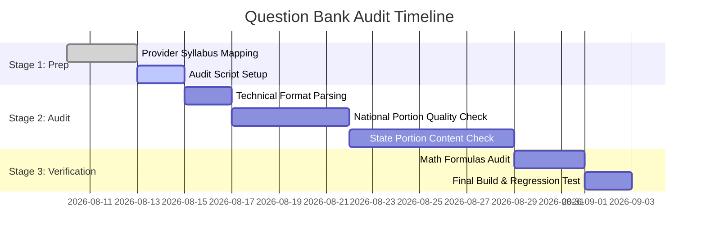

# U.S. Real Estate Question Bank Audit Plan

This document outlines the systematic plan, criteria, and verification procedures to audit and ensure the quality, accuracy, and syllabus alignment of the U.S. Real Estate Practice Question Banks across all 50 states.

---

## 1. Syllabus & Topic Coverage Audit

### A. State-Specific Topics
* **Regulatory Compliance**: Verify questions cover state-specific licensing requirements, license maintenance, continuing education, and disciplinary actions by the state's Real Estate Commission (e.g., TREC, DRE, NYDOS).
* **State Laws & Rules**: Ensure coverage of state agency disclosure requirements, escrow account management, recovery fund rules, and advertising/branding guidelines.
* **Land Ownership & Tenancy**: Audit state-specific rules on homestead exemptions, dower/curtesy rights, community property vs. tenancy by the entirety, and state foreclosure processes.

### B. National Topics
* **Real Estate Principles**: Coverage of property types, land characteristics, legal descriptions (metes and bounds, government survey, lot and block), and bundle of rights.
* **Agency Relationships & Contracts**: Audit for single/dual agency, transaction brokerage, fiduciary duties (OLDCAR), listing agreements, contract validity, and breach remedies.
* **Real Estate Finance**: Coverage of mortgage instruments, loan types (FHA, VA, Conventional), primary/secondary market, lending laws (TILA, RESPA, TRID), and foreclosure.
* **Property Valuation & Market Analysis**: Coverage of appraisal methods (sales comparison, cost, income capitalization), principles of value, and CMA preparation.
* **Transfer of Title & Conveyance**: Audit of deeds (warranty, quitclaim, special warranty), title insurance, transfer taxes, recording acts, and deeds in lieu of foreclosure.

---

## 2. Topic-Wise Weight & Syllabus Alignment

### A. Testing Provider Syllabus Mapping
* **Provider Identification**: Map each state to its official testing administrator (e.g., **PSI**, **Pearson VUE**, **AMP**, or state-specific examiners).
* **Weight Alignment**: Audit the proportion of questions in each category against the provider's official exam content outline (e.g., if Pearson VUE specifies 15% contracts and 10% finance, the question bank must reflect those proportions).
* **National vs. State Split**: Ensure the question distribution accurately matches the official exam split (e.g., Texas TREC: 85 National / 40 State; Nevada NRED: 80 National / 40 State).

---

## 3. Question Integrity & Quality Standards

### A. Structural Completeness
* **Grammar & Readability**: Confirm all questions are written in clear, professional English free from typos, spelling mistakes, or ambiguous phrasing.
* **Plurality & Gender Neutrality**: Ensure exam scenarios use neutral language and consistent terminology (e.g., Buyer/Seller, Landlord/Tenant).
* **No Missing Data**: Check for truncated sentences, missing numeric values in math problems, or broken special characters (e.g., standardizing quotes, hyphens, and currency symbols).

### B. Option & Distractor Design
* **Option Count Consistency**: Verify that every question has exactly 4 options (standard multiple-choice format).
* **Plausible Distractors**: Audit incorrect options (distractors) to ensure they are plausible but clearly incorrect. Avoid obvious giveaways, "silly" answers, or grammatical clues that hint at the correct option.
* **"All of the Above" Restrictions**: Minimize or eliminate the use of "All of the above" or "None of the above" options, as modern exam developers discourage them.

---

## 4. Answer Accuracy & Explanation Quality

### A. Answer Verification
* **Correct Key Association**: Programmatically and manually check that the correct answer index matching the source data corresponds to the absolute correct answer.
* **No Multiple Correct Answers**: Verify that only one option is correct. If a question asks for the "best" or "most likely" answer, ensure the explanation justifies why the other options are inferior.

### B. Explanation Clarity & Educational Value
* **Actionable Explanation**: Every question must have an explanation that explains *why* the correct answer is correct and *why* the other distractors are incorrect.
* **Concept Citations**: Where applicable, reference specific real estate principles, laws (e.g., Civil Rights Act of 1866, Fair Housing Act), or regulatory bodies to reinforce learning.
* **Step-by-Step Math Outlines**: For all math questions (prorations, commission splits, interest rates, cap rates, LTV), the explanation must outline the mathematical formula and the step-by-step calculation.

---

## 5. Duplication, Uniqueness & Distribution

### A. Duplication Pruning
* **Text Similarity Scan**: Implement an automated cosine-similarity or Levenshtein distance check to identify and remove near-duplicate questions.
* **Permutation Cleanup**: Identify questions that are simply paraphrased versions of each other unless intentionally included for repetition.

### B. Cross-State Uniqueness
* **State Boundary Check**: Ensure state-specific questions are restricted to their corresponding state files (e.g., an Oregon licensing question should not appear in the Texas question bank).
* **National Pooling**: Ensure national portion questions are shared across states using a consistent, randomized national questions repository.

### C. Difficulty Leveling
* **Balanced Distribution**: Grade questions into Easy (30%), Medium (50%), and Hard (20%) difficulty levels.
* **Validation**: Align the distribution to mirror the target passing score (e.g., standard 70%-75% pass rate).

---

## 6. Technical Data Format Integrity

### A. CSV Validation
* **Delimiter & Escaping**: Verify that commas, quotes, and newlines inside questions or explanations are correctly escaped (e.g., wrapped in double quotes) to prevent parser shifts or column misalignment.
* **Header Alignment**: Ensure every row contains exactly the columns specified in the header (`id`, `question`, `options`, `correctAnswer`, `explanation`, `category`, `difficulty`).
* **UTF-8 Cleanliness**: Validate that all CSV files are encoded in standard UTF-8 without byte-order marks (BOM) or corrupted Unicode sequences.

---

## 7. Execution Timeline & Milestones

### Milestone Checklist
- [ ] **Milestone 1**: Testing provider matrix completed for all 50 states.
- [ ] **Milestone 2**: Automatic script scan completed for formatting, CSV structure, and duplicate pruning.
- [ ] **Milestone 3**: Subject Matter Expert (SME) validation of state-specific legal and regulatory questions.
- [ ] **Milestone 4**: Step-by-step verification of all real estate mathematical calculations.
- [ ] **Milestone 5**: Full repository deployment integration test.
